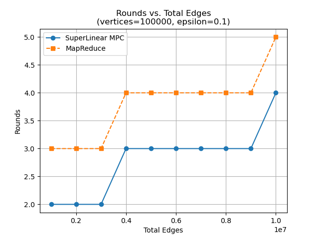
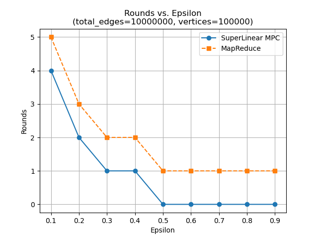
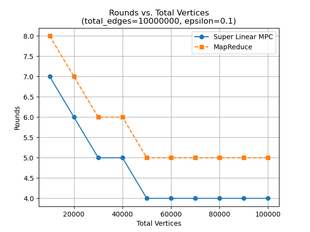

Implementations of the calculation of a Minimum Spanning Tree of a given graph in a distributed setting (in a traditional massively parallel computing setting, as well as a map-reduce variant), assuming super-linear compute per node, as defined [by Mohsen Ghaffari](https://people.csail.mit.edu/ghaffari/MPA19/Notes/MPA.pdf). 

# Benchmarking
<table>
  <tr>
    <td style="text-align: center; vertical-align: top; width: 33%;">
      
       <em>Rounds vs Edges</em>
    </td>
    <td style="text-align: center; vertical-align: top; width: 33%;">
      
       <em>Rounds vs Epsilon</em>
    </td>
    <td style="text-align: center; vertical-align: top; width: 33%;">
      
       <em>Rounds vs Vertices</em>
    </td>
  </tr>
</table>

The benchmarking was mostly done with respect to the number of communication rounds rather than the wall-clock time. In traditional MPC algorithms, this is how performance is measured. 

The Map-Reduce implementation consistently takes one more round than that of its MPC variant because it has to make an additional communication (map + reduce step) to filter down from the graph that can fit in a single node, down to the MST itself. In the MPC implementation, this computation is local to a node and does not require an additional communication. 

It may be significant to note that the MapReduce implementation always took significantly longer, likely because of the repeated reads and writes to disk. Since the MPC implementation is just a local simulation, the cost of each communication was considerably less.

# What? 
## The MPC Implementation 
is inspired by the [Filtering Algorithm](./mpc/docs/spaa11-matchings.pdf) by _Lattanzi et al._. 

For further details, see the [corresponding directory](./mpc/). 

## The MapReduce Implementation
was written with the intention of bridging theory and practice of Distributed Algorithms. It is implemented using `Hadoop`'s primitives. 

For further details, see the [corresponding directory](./map-reduce/). 

# Credits 
[Prof. Kishore Kothapalli](https://scholar.google.com/citations?user=fKTjFPIAAAAJ&hl=en) for his guidance and knowledge of the above algorithms. 
